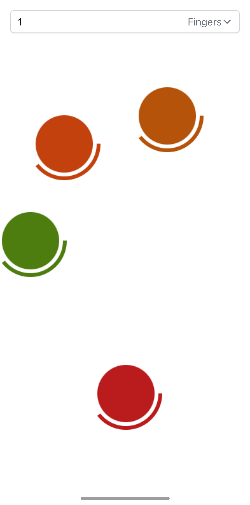
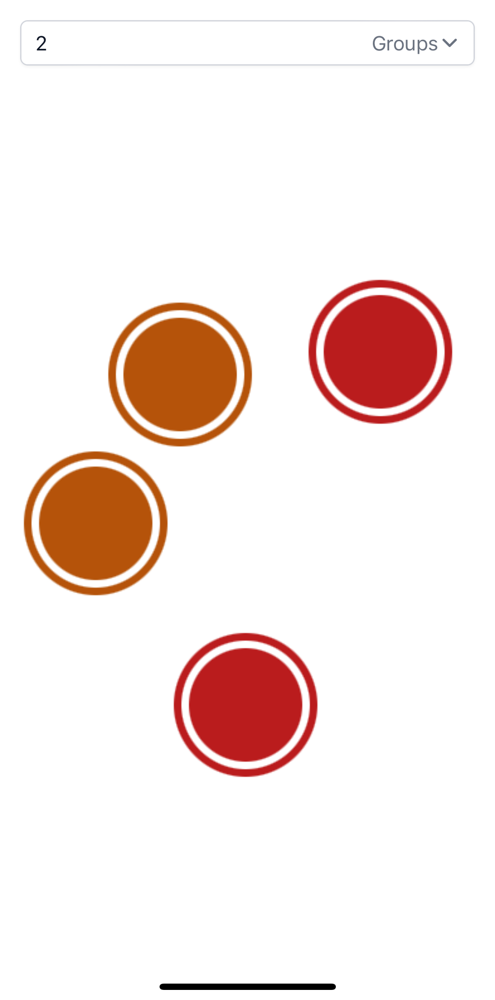
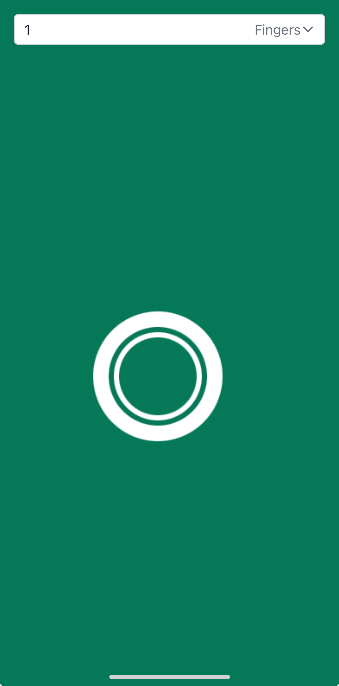
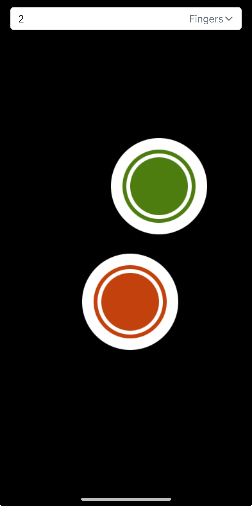

# Chwazi

Pick random person(s) or groups at the touch of a screen.

Web adaptation of the iOS and Android app built by [@ivanseidel](https://github.com/ivanseidel).

## Setup

- Install Javascript development dependencies: `pnpm install`
- Run with any local development HTTP web server, such as [Live Server](https://marketplace.visualstudio.com/items?itemName=ritwickdey.LiveServer).
- Visit site on a touch enabled device (any mobile device will do)
- Enjoy!

## Demo

[Video Demo](https://youtube.com/shorts/Edf6UZbIuDc)

  
  
  
  

